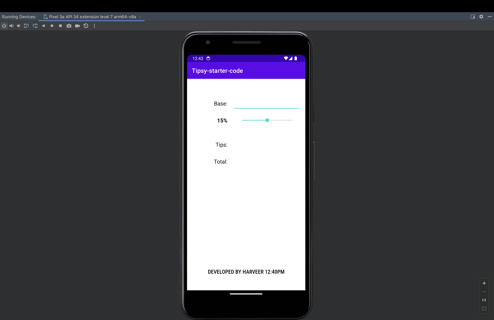
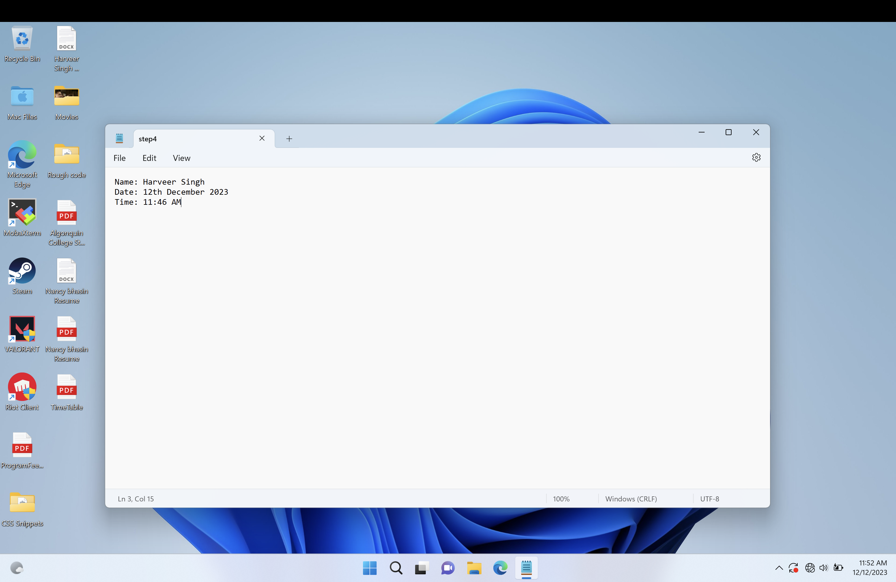

# Harveer Singh Final Project

function getDaysUntilChristmas(){
    let christmasDay = "25th December";
    let today = "12th December";
    
    let christmasDate = christmasDay.split("th");
    let currentDate = today.split("th")
    
    for (i=christmasDate[0];i>=currentDate[0];i--){
        let j = currentDate[0];
        let daysLeft = i-j;
        return `${daysLeft} Days Left For Christmas`;
    }
}

let daysLeft = getDaysUntilChristmas()
console.log(daysLeft)

